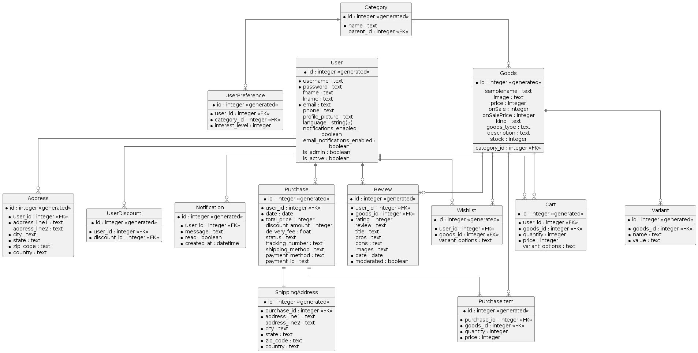

<div align="center">
  

  # Modular Store Flask

  A comprehensive, feature-rich e-commerce platform built with Flask

  [](https://codecov.io/gh/HardMax71/modular-store-flask)
  [](https://github.com/HardMax71/modular-store-flask/actions/workflows/python-lint.yml)
  [](https://opensource.org/licenses/MIT)
  [](https://github.com/HardMax71/modular-store-flask/commits/main)
  [](https://monkfish-app-mbn3z.ondigitalocean.app/)

  [Demo](https://monkfish-app-mbn3z.ondigitalocean.app/) | [Documentation](#) | [Report Bug](https://github.com/HardMax71/modular-store-flask/issues) | [Request Feature](https://github.com/HardMax71/modular-store-flask/issues)

</div>

<div style="background-color: yellow; padding: 10px; border: 1px solid black;">
  <strong>Disclaimer:</strong> The names, trademarks, service marks, logos, and other data displayed on the demo website and in this repository are 
the intellectual property of their respective owners. The utilization of these names, trademarks, service marks, logos, or other proprietary materials 
does not indicate any affiliation with, endorsement by, or sponsorship by the respective trademark owners. All references to such proprietary materials 
are provided solely for illustrative purposes and do not imply any claim of ownership or confer any legal rights. The repository owner expressly disclaims 
any legal liability or responsibility for any misuse, misinterpretation, or misrepresentation of these proprietary materials.
</div>


## About The Project

Modular Store Flask is a state-of-the-art e-commerce solution designed to provide a flexible and scalable platform for online stores. Built with Flask, it offers a wide range of features to enhance both user experience and store management.

### Key Features

- 🛒 **Robust Shopping Cart System**: Seamless shopping experience with real-time updates.
- 🔍 **Advanced Product Search & Filtering**: Help customers find exactly what they're looking for.
- 👤 **User Authentication & Profiles**: Secure login and personalized user experiences.
- 💳 **Multiple Payment Gateways**: Support for various payment methods to accommodate all customers.
- 📊 **Admin Dashboard**: Comprehensive tools for managing products, orders, and customers.
- 🌐 **Multi-language Support**: Reach a global audience with localized content.
- 📱 **Responsive Design**: Perfect shopping experience across all devices.
- 🔒 **Security Features**: Implement best practices to keep your store and customers safe.

<details>
<summary>Getting Started</summary>

### Prerequisites

- Python 3.8+
- pip
- Virtual environment (recommended)

### Installation

1. Clone the repository:
   ```
   git clone https://github.com/HardMax71/modular-store-flask.git
   cd modular-store-flask
   ```

2. Create and activate a virtual environment:
   ```
   python -m venv venv
   source venv/bin/activate  # On Windows, use `venv\Scripts\activate`
   ```

3. Install the required packages:
   ```
   pip install -r requirements.txt
   ```

4. Run the application:
   ```
   python app.py
   ```

Visit `http://localhost:5000` in your browser to see the application running.

</details>

<details>
<summary>Current state of things</summary>

| Feature Category               | Feature Idea                                                                                                                                                                                                                                                                                                                                                                        | Status                                                                                                                       |
|--------------------------------|-------------------------------------------------------------------------------------------------------------------------------------------------------------------------------------------------------------------------------------------------------------------------------------------------------------------------------------------------------------------------------------|------------------------------------------------------------------------------------------------------------------------------|
| Product Catalog                | * Display products with images, prices, and other relevant information<br> * Implement product categories and subcategories for better organization<br> * Allow users to search for products based on keywords, categories, or tags<br> * Implement product filtering and sorting options<br> * Display related products or product recommendations                                 | :heavy_check_mark:                                                                                                           |
| Product Details                | * Create a detailed product page with all relevant information<br> * Display product variants (e.g., size, color) and allow users to select them<br> * Show product reviews and ratings from other users<br> * Implement a product rating system for users to rate products<br> * Allow users to add products to their wishlist                                                     | :heavy_check_mark:                                                                                                           |
| Shopping Cart                  | * Allow users to add products to their shopping cart<br> * Display the total price and number of items in the cart<br> * Provide options to update quantities or remove items from the cart<br> * Implement a mini-cart or quick view of the cart contents<br> * Allow users to apply discount codes or promotional offers                                                          | :heavy_check_mark:                                                                                                           |
| Checkout Process               | * Implement a multi-step checkout process (e.g., shipping address, billing information, order summary)<br> * Allow users to select a shipping address or add a new one<br> * Provide options for different shipping methods and calculate shipping costs<br> * Integrate with a payment gateway for secure online payments<br> * Display order confirmation and send email receipts | :heavy_check_mark: <br/>Payments with stripe - done; Maybe add some other payment systems?                                   |
| Order Management               | * Implement an order tracking system for users to view their order status<br> * Allow users to view their order history and details<br> * Provide options for users to cancel or modify orders (if applicable)<br> * Send email notifications for order updates and shipping information                                                                                            | :heavy_check_mark:                                                                                                           |
| User Reviews and Ratings       | * Allow users to write reviews and rate products they have purchased<br> * Display user reviews and ratings on product pages<br> * Implement a moderation system for reviewing and approving user-generated content<br> * Provide options for users to report inappropriate reviews or ratings                                                                                      | :heavy_check_mark:                                                                                                           |
| Wishlist Functionality         | * Allow users to add products to their wishlist<br> * Provide options to manage wishlist items (remove, add to cart)<br> * Send email notifications or reminders for wishlist items on sale or back in stock                                                                                                                                                                        | :heavy_check_mark:                                                                                                           |
| Discounts and Promotions       | * Implement a discount code system for promotional offers<br> * Apply discounts automatically during the checkout process<br> * Display promotional banners or popups for ongoing sales or special offers<br> * Send email notifications for personalized discounts or limited-time offers                                                                                          | :heavy_check_mark:                                                                                                           |
| Notifications and Alerts       | * Implement a notification system for users (e.g., order updates, product back in stock)<br> * Allow users to manage their notification preferences<br> * Send email alerts for important events or updates                                                                                                                                                                         | :question: <br/>User can opt in/out for notifications, <br/>but maybe add custom button for admin to set/send notifications? |
| Product Inventory Management   | * Track product inventory levels and update them in real-time<br> * Implement low stock alerts or notifications for admin users<br> * Provide options to mark products as out of stock or discontinued                                                                                                                                                                              | :heavy_check_mark:                                                                                                           |
| Analytics and Reporting        | * Implement analytics tracking for user behavior and sales data<br> * Generate reports for sales, revenue, and product performance<br> * Provide insights and metrics for marketing and business decisions                                                                                                                                                                          | :heavy_check_mark: (in admin dashboard)                                                                                      |
| Search and Autocomplete        | * Implement a search functionality for users to find products easily<br> * Provide autocomplete suggestions based on user input<br> * Optimize search results based on relevance and popularity                                                                                                                                                                                     | :question: In general - done, but not optimized                                                                              |
| Product Comparison             | * Allow users to compare multiple products side by side<br> * Display key features, specifications, and prices for easy comparison<br> * Provide options to add compared products to the cart or wishlist                                                                                                                                                                           | :heavy_check_mark:                                                                                                           |
| Social Sharing and Integration | * Implement social sharing buttons for products and pages<br> * Allow users to login or register using their social media accounts<br> * Integrate with social media platforms for product promotion and user engagement                                                                                                                                                            | :heavy_check_mark:                                                                                                           |
| Customer Support and Live Chat | * Implement a customer support ticketing system<br> * Provide live chat functionality for real-time assistance<br> * Offer self-service options like FAQs or knowledge base articles                                                                                                                                                                                                | :question: FAQ - done; Ticketing system - done; Live chat - to do                                                            |
| Mobile Optimization and Design | * Ensure the web store is fully responsive and mobile-friendly<br> * Optimize images and assets for faster loading on mobile devices<br> * Implement mobile-specific features like swipe gestures or mobile payments                                                                                                                                                                | :question: Viewpoint - done, lazy loading - done, img-fluid - done.                                                          |
| Internationalization           | * Support multiple languages and currencies for a global audience<br> * Implement geolocation to detect user's location and adapt the store accordingly<br> * Provide options for users to switch languages or currencies                                                                                                                                                           | :heavy_check_mark: <br/>\[2 langs supported, using user settings<br/>to detect best possible lang\]                          |
| Personalization and Recs       | * Implement personalized product recommendations based on user behavior<br> * Display recently viewed or related products for each user<br> * Send personalized email campaigns or newsletters based on user preferences                                                                                                                                                            | :heavy_check_mark: <br/>\[except sending mails\]                                                                             |
| Security and Privacy           | * Implement secure user authentication and authorization<br> * Protect user data and transactions with encryption and secure protocols<br> * Comply with relevant privacy regulations (e.g., GDPR, CCPA)<br> * Regularly update and patch software to address security vulnerabilities                                                                                              | :heavy_check_mark: <br/>\[except GDPR stuff\]                                                                                |
| Performance Optimization       | * Optimize website speed and performance for better user experience<br> * Implement caching mechanisms for faster page loading<br> * Minimize the use of third-party scripts or plugins that may slow down the site<br> * Regularly monitor and optimize database queries for improved performance                                                                                  |                                                                                                                              |
| Accessibility                  | * Ensure the web store is accessible to users with disabilities<br> * Follow web accessibility guidelines (e.g., WCAG) for inclusive design<br> * Provide alternative text for images and proper labeling for form elements<br> * Test the store for compatibility with assistive technologies                                                                                      |                                                                                                                              |
| Testing and Quality Assurance  | * Implement a comprehensive testing strategy for the web store<br> * Conduct functional testing, usability testing, and performance testing<br> * Perform cross-browser and cross-device testing for compatibility<br> * Establish a quality assurance process to identify and fix bugs or issues                                                                                   |                                                                                                                              |
| Backup and Disaster Recovery   | * Implement regular data backups to prevent data loss<br> * Develop a disaster recovery plan for unexpected events or system failures<br> * Test the backup and recovery processes periodically to ensure their effectiveness                                                                                                                                                       | :heavy_check_mark:                                                                                                           |

</details>

## Project Structure

Each module listed below is per se a package, with:
- `__init__.py`: Initializes the module and registers routes and views (in a blueprint).

Also may contain any of the following files:
- `views.py`: Contains the route definitions and view functions.
- `utils.py`: Contains utility functions specific to the module.

```
modular-store-flask/
│
├── app.py                 # Main application entry point
├── config.py              # Configuration settings
├── requirements.txt       # Project dependencies
|
├── README.md              # Project overview and instructions
├── LICENSE.md             # License information
├── .gitignore             # Files and directories to ignore in Git
│
├── forms/                 # Form classes for user input validation
│
├── instance/              # contains single file - data.db (SQLite database)
│
├── modules/               # Application modules
│   ├── admin/             # Admin-related functionality
│   ├── auth/              # Authentication module
│   ├── carts/             # Shopping cart functionality
│   ├── compare/           # Product comparison feature
│   ├── db/                # Database models and operations
│   ├── error_handlers/    # Error handling module
│   ├── extensions/        # locale, mail, security, and other extensions
│   ├── filter/            # Product filtering functionality
│   ├── main/              # Main routes and views
│   ├── profile/           # User profile management
│   ├── purchase_history/  # Order history and tracking
│   ├── recommendations/   # Product recommendation system
│   ├── reviews/           # Product review functionality
│   ├── tickets/           # Customer support ticket system
│   ├── wishlists/         # Wishlist functionality
│   └── ... (single .py files for other features, like caching, logging, ..)
│
├── static/                # Static files (CSS, JS, images)
│   ├── css/
│   ├── js/
│   ├── img/
│   └── robots.txt        # Robots file for search engine indexing
│
├── templates/             # HTML templates
│   ├── admin/
│   ├── auth/
│   ├── cart/
│   ├── error/
│   └── tickets/
│
├── translations/          # Internationalization files
│
└── tests/                 # Unit and integration tests
    ├── unit/
    └── integration/
```

This structure represents the main components of the Modular Store Flask project:

- `app.py`: The main entry point of the application.
- `config.py`: Contains configuration settings for different environments.
- `modules/`: Houses the different functional modules of the application.
- `static/`: Contains all static files like CSS, JavaScript, and images.
- `templates/`: Holds all the HTML templates used in the application.
- `translations/`: Contains files for internationalization support.
- `instance/`: Stores instance-specific configurations (not version controlled).
- `tests/`: Contains all the unit and integration tests for the project.

Each module in the `modules/` directory typically contains its own views, forms, and utility functions,
promoting a modular and maintainable code structure.

## Database Schema

Simplified database schema for the application:



## License

This project is licensed under the MIT License - see the [LICENSE.md](LICENSE.md) file for details.


